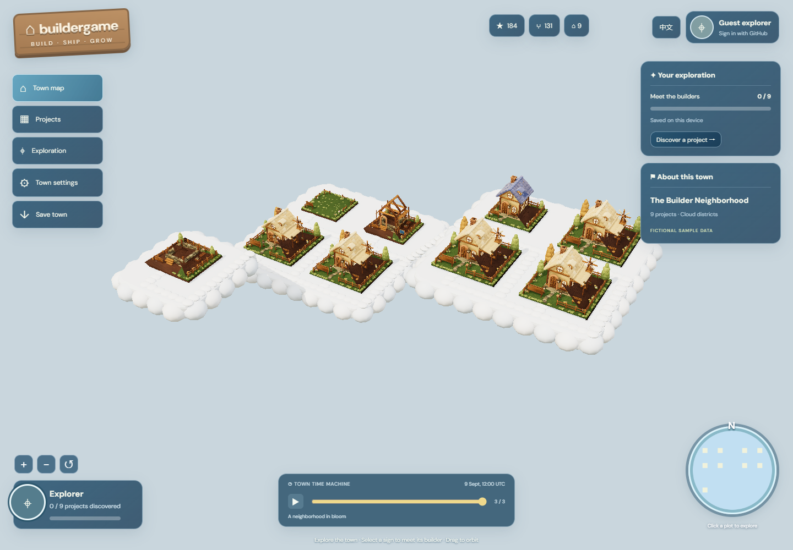

# Buildergame 🏡

**Your repos. Your town. A place for everything you build.**

Turn a collection of GitHub projects into a little 3D neighborhood. Each repository gets a house, each builder gets a sign, and recorded snapshots let visitors travel through the town's history.

Build a home for your public portfolio, or bring a whole hackathon community together on one map.



*Cloud-town preview with fictional sample data. Choose flat streets, a valley or cloud districts when creating your town.*

[Explore the idea](#a-town-you-can-explore) · [Make-it-yours workflow](#make-it-yours) · [Development status](#development-status) · [Hackathon review](hackathon/README.md)

> **Playable Demo.** Explore a flat town, valley or cloud neighborhood, create a town from public repositories, and carry its history in a JSON backup. Play as a guest or connect GitHub when the deployment supports login. English and Chinese are supported.

## Quick start

Use Node.js 22.12 or newer:

```sh
npm install
npm run dev
```

Open **http://127.0.0.1:5173**. Choose one of the three sample landscapes to explore immediately, **My builder town** for a portfolio, or **A hackathon neighborhood** for a collection from multiple builders.

For GitHub login and hosting, follow the [deployment guide](docs/deployment.md). Without OAuth configured, you can preview up to 20 public repositories; the sample town needs no credentials.

## A town you can explore

**Give every project an address.** Repositories keep their own plots. A small experiment and a long-running project can sit side by side, each with a door into what its builder made.

**Watch the neighborhood change.** Move between recorded snapshots while the plots stay in place. A foundation grows into a timber frame, then a home with a furnished garden. Return to an earlier snapshot to see how it looked then.

**Meet the people behind the houses.** Select a wooden sign to discover a project and its builder. Visit the demo, explore the code, or head to GitHub to star a repository or follow its author.

**Find your next stop.** Orbit, zoom and move around the town, select a plot on the minimap, or search the project directory. Translucent controls keep the town visible, and project cards show a building preview alongside the repository's details.

**Keep track of your discoveries.** Opening project cards records which projects you have explored. Guests keep progress in their browser; GitHub players can synchronize progress for the deployment's published town when login is configured.

| In the town | What it represents |
| --- | --- |
| 🏡 A house | A GitHub repository |
| 📍 A permanent plot | The project's place across snapshots |
| 🪧 A wooden sign | Project details and builder profile |
| ⏳ The town timeline | Previously recorded versions of the neighborhood |
| 🌱 A changing building | Progress under the town owner's chosen rules |

The five accepted appearances run from **green plot → foundation → timber frame → blue-roof shell → furnished garden home**. The snapshot schema retains six scoring labels for compatibility; `townhouse` and `decorated` share the final appearance. Owners choose how data maps to those appearances. Buildings express the owner's rules and do not establish a universal quality rating.

Choose a landscape when creating a town: **Flat** has level ground and concrete streets, **Valley** uses gravel paths, slopes and water around level building pads, and **Clouds** places neighborhoods on elevated cloud platforms with small cloud steps. This choice stays fixed throughout that town's history. Larger initial collections automatically occupy more land or cloud districts.

## What will your town be?

**A developer's portfolio.** Choose the public repositories you want to share. Give visitors a place to explore your experiments, tools and ongoing work—and a reason to come back.

**A hackathon neighborhood.** Put participating projects on a shared map. Publish a snapshot after demo day, or keep adding observations so people can follow what happens next.

Both use the same core idea: a curated collection, fixed plots, project links and visible history.

## Make it yours

Create a town in a few steps:

1. **Name your town.** Choose a title and a landscape for your portfolio or event.
2. **Choose your neighbors.** Supply a curated list of public GitHub repositories, builder profiles and optional demo links.
3. **Choose what shapes the houses.** Use cumulative commits, stars, a weighted mix of commits/stars/forks, or your own complete score table.
4. **Record a moment.** Capture repository observations as a snapshot. Earlier snapshots keep their recorded appearance.
5. **Share the town.** Self-host a fixed showcase, or publish new snapshots to keep the timeline growing.

The experience works without wallets. Star and follow links take visitors to GitHub, where they choose whether to perform the action.

After capture, select **Enter my town** to explore. Choose **Save town** to download all recorded snapshots. Add the exported `town.json` to `public/data/` in your deployment repository and rebuild to publish a static town. **No GitHub repository writes happen automatically.**

Use [the example configuration](examples/hackathon.config.json) for file-based setup. A Node deployment also lets the allowed GitHub deployer publish snapshots directly; ordinary visitors can browse without signing in.

### Growth at your pace

- **You choose the rules.** A portfolio and an event can express different priorities.
- **Taking a break does not erase construction.** With the same cumulative commit total and mapping, a house stays the same.
- **Missing data is not empty land.** Failed observations retain the last known state or show that data is unavailable.
- **History starts when it is recorded.** Today's star count cannot reconstruct what a repository had last month.

## Development status

| Area | Current state |
| --- | --- |
| Five building appearances | Accepted and locked; full and distant GLBs are checked by SHA-256 |
| Flat, valley and cloud landscapes | Implemented; fixed for each town and generated from its initial collection |
| Timeline, searchable directory, signs, cards and minimap | Implemented; current desktop/mobile browser checks passed |
| Growth rules and snapshot backup/restore | Implemented; data/API tests passed |
| Sample data and public GitHub capture | Implemented; real public-repository reads verified |
| Personal and hackathon setup; English/Chinese | Implemented; both UI flows checked |
| Deployer GitHub OAuth and public publishing | Implemented and tested with mocked OAuth; real app credentials required |
| Guest progress and GitHub player avatars/progress | Implemented; server synchronization needs configured OAuth and persistent storage |
| Walking, building interiors, list sorting and resident world map | Deferred |
| Hosted production Demo and broader device testing | Not completed |

The three sample towns use fictional projects and metrics. A static host supports viewing, local progress and backups; GitHub login and capture need the Node service. Changing a collection starts a new town rather than rewriting its old roster. See [verification and limitations](docs/verification.md) and [landscape/player setup](docs/landscape-deployment.md).

## For builders

Built with **TypeScript, Three.js, Vite and Node.js**. The implementation keeps repository data, growth rules and house models separate so the town can change its look without rewriting its history.

| File | Start here to… |
| --- | --- |
| [src/town.ts](src/town.ts) | Explore scene rendering, camera controls and project selection |
| [src/terrain.ts](src/terrain.ts) and [src/landscape.mjs](src/landscape.mjs) | Understand generated scenery and stable landscape positions |
| [src/town-assets.ts](src/town-assets.ts) | Follow the locked GLB loading, instancing and distance detail levels |
| [scripts/art/](scripts/art/) | Inspect the reproducible Blender source for the accepted buildings |
| [src/model.mjs](src/model.mjs) | Understand growth rules and snapshot validation |
| [src/main.ts](src/main.ts) and [src/game-ui.ts](src/game-ui.ts) | Explore setup, floating controls, cards and project interactions |
| [src/player-progress.ts](src/player-progress.ts) and [server/progress.mjs](server/progress.mjs) | Follow local and account-scoped exploration storage |
| [src/types.ts](src/types.ts) | Inspect the configuration and snapshot data shapes |
| [src/links.ts](src/links.ts) | Understand project destinations |
| [server/](server/) | Explore OAuth, public GitHub capture and snapshot publishing |

Run `npm test` for data/API checks and `npm run build` for validation and production output.

The current buildings are intentionally locked: normal validation checks all ten full/distant GLBs. Landscape development should reuse them. The [generation assessment](docs/procedural-town-plan.md) explains layout options and the separate work needed to add projects to an existing town's history.

Feedback on project discovery, town visuals and the portfolio workflow is welcome in [Issues](https://github.com/ForOneIce/buildergame/issues).

Competition materials, development provenance and AI disclosure are collected in the [hackathon review guide](hackathon/README.md).
