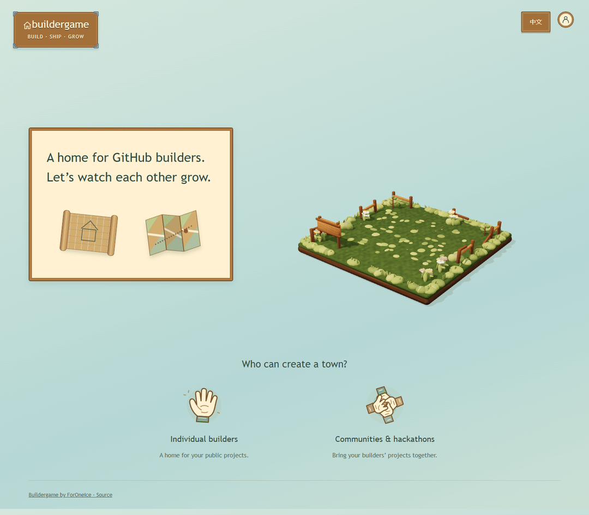

# Buildergame 🏡

**Your repos. Your town. A place for everything you build.**

Turn a collection of GitHub projects into a little 3D neighborhood. Each repository gets a house, each builder gets a sign, and recorded snapshots let visitors travel through the town's history.

Build a home for your public portfolio, or bring a whole hackathon community together on one map.



*From an empty plot to a welcoming home: the homepage cycles through all five building stages.*

[Explore the idea](#a-town-you-can-explore) · [Make-it-yours workflow](#make-it-yours) · [Development status](#development-status) · [Hackathon review](hackathon/README.md)

> **Playable Demo.** Explore a flat town, valley or cloud neighborhood, create a town from public repositories, and carry its history in a JSON backup. Play as a guest or connect GitHub to import your projects. English and Chinese are supported. The published source also includes optional Privy developer support; hosted wallet activation and live Sepolia verification are in progress.

## Quick start

Use Node.js 22.12 or newer:

```sh
npm install
npm run dev
```

Open **http://127.0.0.1:5173**. Select **Explore sample town**, then **Tour landscapes** to try flat, valley or cloud scenery. Select **Create town**, then **Personal** for your repositories or **Community** for a collection from multiple builders.

For GitHub connection and hosting, follow the [deployment guide](docs/deployment.md). The upper-right profile button accepts a GitHub token for direct browser access to public repositories; no backend is needed for this mode. The sample town needs no credentials. [Deploy on Vercel](docs/vercel.md). To offer optional developer support, follow the [Privy wallet setup guide](readme_web3.md); the base experience needs no Privy setup.

## A town you can explore

**Give every project an address.** Repositories keep their own plots. A small experiment and a long-running project can sit side by side, each with a door into what its builder made.

**Watch the neighborhood change.** Move between recorded snapshots while the plots stay in place. A foundation grows into a timber frame, then a home with a furnished garden. Return to an earlier snapshot to see how it looked then.

**Meet the people behind the houses.** Select a wooden sign to discover a project and its builder. Visit the demo, explore the code, or head to GitHub to star a repository or follow its author.

**Find your next stop.** Unfold the map, then orbit, zoom and move around the town. Pick a plot on the minimap or search the project directory. Cream visitor cards introduce each builder and project; opening a house reveals a doorway with a link to visit the project in a new tab.

**Draw your own neighborhood.** Open a kraft-paper planning sheet, choose public repositories and a landscape, then capture your first snapshot. Wooden controls, paper cards and transparent teal panels connect the entrance, planning desk and town. The current interface refinement gives sample and created towns the same controls, with landscape tours reserved for samples.

**Keep track of your discoveries.** Opening project cards records which projects you have explored in this browser only. **Random explore** introduces an undiscovered project when one is available.

**Leave a little encouragement.** Hover over a garden home's mailbox to turn your pointer into a coin. Keep it playful with virtual deposits, or let a town creator enable direct support for builders. The optional Privy extension offers email or wallet sign-in, a clear recipient/amount review and explicit confirmation; a successful receipt triggers the coin celebration. Its first release targets Sepolia test ETH, with live verification still pending. [Configure optional support](readme_web3.md).

**Hear the little interactions.** Soft clicks, paper unfolding and a coin chime accompany controls after your first interaction. A gentle [planning-desk track](music/README.md) loops only while creating a town. The upper-right speaker button mutes music and effects together and remembers the setting on this device. Six small [Kenney CC0 clips](docs/ui-audio-research.md) provide the interface sounds; all audio is served locally.

Sample towns open at a closer view, equivalent to four zoom-in steps, so signs and mailboxes are easier to reach. **Reset camera** returns to that view; zoom out for the full neighborhood.

| In the town | What it represents |
| --- | --- |
| 🏡 A house | A GitHub repository |
| 📍 A permanent plot | The project's place across snapshots |
| 🪧 A wooden sign | Project details and builder profile |
| ⏳ The town timeline | Previously recorded versions of the neighborhood |
| 🌱 A changing building | Progress under the town owner's chosen rules |

The five accepted appearances run from **green plot → foundation → timber frame → blue-roof shell → furnished garden home**. The snapshot schema retains six scoring labels for compatibility; `townhouse` and `decorated` share the final appearance. Owners choose how data maps to those appearances. Buildings express the owner's rules and do not establish a universal quality rating.

Choose a landscape when creating a town: **Flat** has level ground and concrete streets, **Valley** uses gravel paths, slopes and water around level building pads, and **Clouds** places neighborhoods on elevated cloud platforms with small cloud steps. This choice stays fixed throughout that town's history. Larger initial collections automatically occupy more land or cloud districts.

## What will your town be?

**A developer's portfolio.** Choose the public repositories you want to share. Give visitors a place to explore your experiments, tools and ongoing work—and a reason to come back.

**A hackathon neighborhood.** Put participating projects on a shared map. Publish a snapshot after demo day, or keep adding observations so people can follow what happens next.

Both use the same core idea: a curated collection, fixed plots, project links and visible history.

## Make it yours

Create a town in a few steps:

1. **Name your town.** Choose a title and a landscape for your portfolio or event.
2. **Choose your neighbors.** Supply a curated list of public GitHub repositories, builder profiles and optional demo links.
3. **Choose what shapes the houses.** Use cumulative commits, stars, a weighted mix of commits/stars/forks, or your own complete score table.
4. **Record a moment.** Capture repository observations as a snapshot. Earlier snapshots keep their recorded appearance.
5. **Share the town.** Self-host a fixed showcase, or publish new snapshots to keep the timeline growing.

Star and follow links take visitors to GitHub, where they choose whether to perform the action. **Builder support (optional)** lets a creator add one personal receiving address or per-project community recipients. Each community decides how encouragement fits its town; ordinary discovery, snapshots and virtual coins remain independent. See [wallet prerequisites and deployment](readme_web3.md) before enabling it.

After capture, select **Enter my town** to explore. Each new town starts with an all-stage-one founding view, followed by the first measured snapshot, so its growth can be played immediately. Export `<slug>.json` to `public/data/towns/` in your deployment repository and rebuild to publish `/towns/<name-and-timestamp>/`. Existing names and addresses are preserved across snapshots. **No GitHub repository writes happen automatically.**

That repository-publication workflow currently applies to town data without populated support recipients. Keep recipient-containing backups local while the optional support publication workflow is finalized; see the [support configuration boundary](readme_web3.md#recipient-fields).

Not ready to capture yet? Open **Not ready yet? → Save draft** in the planner to download `town.plan.json`, then use **Load a plan** to continue later. A draft can contain unfinished fields and has no snapshots. **Export deployment configuration** produces a complete `town.config.json` for configuration import or CLI capture; a draft cannot replace that input. Use [the example configuration](examples/hackathon.config.json) for file-based setup.

To maintain a town already loaded in this browser, return to the planning sheet and open **Not ready yet? → Continue current town**. This resumes its existing configuration/history with the landscape locked; **Back up current town** exports its current snapshot data. These maintenance actions appear for actual towns, keeping the visitor interface focused on exploration. The continuation browser fixture passed; recipient-containing backups retain the local-only publication boundary above.

Static deployments support token connection and manual captures directly in the browser. Unpublished towns use `?preview=<slug>` to support refresh in that browser; they become publicly shareable at `/towns/<slug>/` after their JSON is committed and redeployed. An optional Node deployment lets OAuth-authenticated builders publish their own towns immediately. Ordinary visitors need no account to explore published towns.

### Growth at your pace

- **You choose the rules.** A portfolio and an event can express different priorities.
- **Taking a break does not erase construction.** With the same cumulative commit total and mapping, a house stays the same.
- **Missing data is not empty land.** Failed observations retain the last known state or show that data is unavailable.
- **History starts when it is recorded.** Today's star count cannot reconstruct what a repository had last month.

## Development status

| Area | Current state |
| --- | --- |
| Five building appearances | Accepted and locked; full and distant GLBs are checked by SHA-256 |
| Flat, valley and cloud landscapes | Implemented; fixed for each town and generated from its initial collection |
| Timeline, searchable directory, signs, cards and minimap | Implemented; shared sample/created-town controls passed desktop/mobile parity and map-browser checks |
| Growth rules and snapshot backup/restore | Implemented; data/API tests passed |
| Sample data and public GitHub capture | Implemented; real public-repository reads verified |
| Personal and hackathon setup; English/Chinese | Implemented; both UI flows checked |
| Deployer GitHub OAuth and public publishing | Implemented and tested with mocked OAuth; real app credentials required |
| Direct GitHub token connection, avatar and manual capture | Implemented without a backend; token stays in page memory |
| Mailbox Easter egg | Unconfigured mailboxes retain virtual coins independently of wallet support |
| Optional Privy support | Published Email/wallet integration and direct Sepolia test-ETH flow, with notices, explicit review, critical-state locking and pending recovery. Hosted wallet activation and live login/transfer verification remain pending |
| Guest and signed-in exploration progress | Browser-only storage; no server synchronization |
| Independent town URLs and repository-backed static deployment | Implemented; JSON backups produce physical town pages on build |
| Walking, building interiors, list sorting and resident world map | Deferred |
| Hosted demo and broader device testing | Current town release deployed and home/sample checked; activating its wallet SDK and broader device coverage need verification. Existing videos show the earlier release |

The three sample towns use fictional projects and metrics. Static hosts support direct GitHub token connection, manual captures, viewing and local progress. OAuth and immediate server publication use the optional Node service. There is no automatic live-data refresh in this version. Changing a collection starts a new town rather than rewriting its old roster. See [verification and limitations](docs/verification.md) and [deployment setup](docs/deployment.md).

The latest local suite passed **82 Node tests**, with scoped browser fixtures covering the wallet flow and shared town controls, plus **21 compact-wallet scenarios**. The final combined production build passed, and release `3bf2596` was deployed on Vercel with its home/sample checked. The hosted wallet path still needs its public App ID configured and a rebuild; live receipt verification remains pending. Existing videos show the earlier town release. [Evidence and boundaries](docs/verification.md).

### What comes next

1. **Activate the hosted wallet path.** Configure the public Privy App ID in the host's build environment and rebuild. The code and town release are already published.
2. **Verify the complete experience.** Create a wallet-enabled town and exercise an actual Privy login, Sepolia receipt, cancellation and recovery without disrupting ordinary exploration.
3. **Show the complete journey.** Record an updated demonstration from that verified build and refresh the submission materials.

Longer term, wallet/ENS identity, community membership and management permissions, and recorded on-chain milestones could connect discovery with lasting participation. These are planned directions, not features enabled by the current testnet extension.

## For builders

Built with **TypeScript, Three.js, Vite and Node.js**. The implementation keeps repository data, growth rules and house models separate so the town can change its look without rewriting its history.

| File | Start here to… |
| --- | --- |
| [src/town.ts](src/town.ts) | Explore scene rendering, camera controls and project selection |
| [src/terrain.ts](src/terrain.ts) and [src/landscape.mjs](src/landscape.mjs) | Understand generated scenery and stable landscape positions |
| [src/town-assets.ts](src/town-assets.ts) | Follow the locked GLB loading, instancing and distance detail levels |
| [scripts/art/](scripts/art/) | Inspect the reproducible Blender source for the accepted buildings |
| [src/model.mjs](src/model.mjs) | Understand growth rules and snapshot validation |
| [src/main.ts](src/main.ts) and [src/game-ui.ts](src/game-ui.ts) | Explore setup, floating controls, cards and project interactions |
| [src/player-progress.ts](src/player-progress.ts) | Follow browser-only exploration storage |
| [src/browser-github.mjs](src/browser-github.mjs) | Follow direct GitHub requests and their error handling |
| [readme_web3.md](readme_web3.md) and [src/support/](src/support/) | Configure the optional Privy extension and inspect its wallet/transaction lifecycle |
| [src/types.ts](src/types.ts) | Inspect the configuration and snapshot data shapes |
| [src/links.ts](src/links.ts) | Understand project destinations |
| [server/](server/) | Explore OAuth, public GitHub capture and snapshot publishing |

Run `npm test` for data/API checks and `npm run build` for validation and production output.

The current buildings are intentionally locked: normal validation checks all ten full/distant GLBs. Landscape development should reuse them. The [generation assessment](docs/procedural-town-plan.md) explains layout options and the separate work needed to add projects to an existing town's history.

Feedback on project discovery, town visuals and the portfolio workflow is welcome in [Issues](https://github.com/ForOneIce/buildergame/issues).

Competition materials, development provenance and AI disclosure are collected in the [hackathon review guide](hackathon/README.md).

## License

Buildergame uses the [Buildergame Noncommercial Source-Available License 1.0](LICENSE): noncommercial use, visible **Buildergame by ForOneIce** attribution, and public corresponding source under the same terms when you distribute a version or offer it over a network. Commercial use requires separate written permission. This is a source-available license, not an OSI-approved open-source license.

Existing CC0 building/UI assets and third-party dependencies retain their own licenses; see [NOTICE](NOTICE). Projects displayed in a town retain their owners' rights.

中文简注：非商业使用须署名；分发或提供在线版本须公开对应源码并保留相同条款。商用需另行书面授权。
