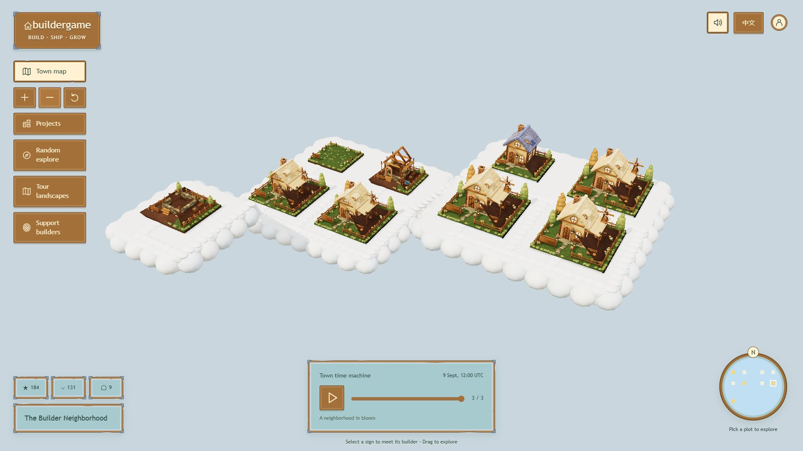

# Buildergame — ETHOnline 2026

A living 3D home for GitHub builders to showcase projects, share progress, and grow together.

[Live application](https://buildergame-two.vercel.app/) · [Interactive demonstration](https://buildergame-two.vercel.app/demo/) · [GitHub repository](https://github.com/ForOneIce/buildergame) · [Technical overview and Privy evidence](summitinfo.md)

*Actual application screenshot with fictional sample projects.*

## The experience

Public GitHub repositories become buildings on permanent plots. Town owners choose the growth rules, and recorded snapshots let visitors see how the town changes. Five building appearances progress from land to a garden home; accumulated commit progress does not decay through inactivity.

Individual builders can create a portfolio town, while communities can bring several projects together. The working application includes personal/community planning, flat/valley/cloud landscapes, project cards, a directory and minimap, English/Chinese interfaces, real GitHub capture, snapshot playback and portable JSON backups. Exported town snapshots can be hosted as static pages.

## Optional builder support

Creators can enable direct support through Privy on Ethereum Sepolia. Visitors sign in by email or connect a wallet, review the recipient, amount and fee, then personally approve the transfer. The app confirms success only after checking the transaction receipt. Support does not change house growth. Sample coins remain virtual effects.

Hosted checks verified login, insufficient-funds handling, a human-approved 0.001 Sepolia test-ETH transfer with an independently checked matching receipt, and cancellation before submission with restored interaction. The final demonstration records a fresh GitHub town and a new human-approved transfer through the actual application.

## Final demonstration

The completed video is **3:37.68**, **1280×720**, with human narration, original interface effects and no background music. The [interactive HTML demonstration](https://buildergame-two.vercel.app/demo/) provides a separate overview with real app images and code references.

## Evidence and limitations

The latest recorded suite passed **82 Node tests**, including **33 transaction fixtures**, and **21 compact-wallet browser scenarios**; the production build passed. See [verification](../docs/verification.md) for the exact scope.

The wallet demo uses Sepolia test ETH, which has no monetary value. Interrupted session/reload recovery remains unverified and is deferred to the [next version](../docs/backlog.md). ENS identity, community permissions and on-chain milestones are future directions.

[Media and provenance](media/README.md) · [AI disclosure](../collaboration/AI_USAGE.md) · [Reuse baseline](../collaboration/baseline.md) · [Specifications](../specs/README.md) · [Project license](../LICENSE)
